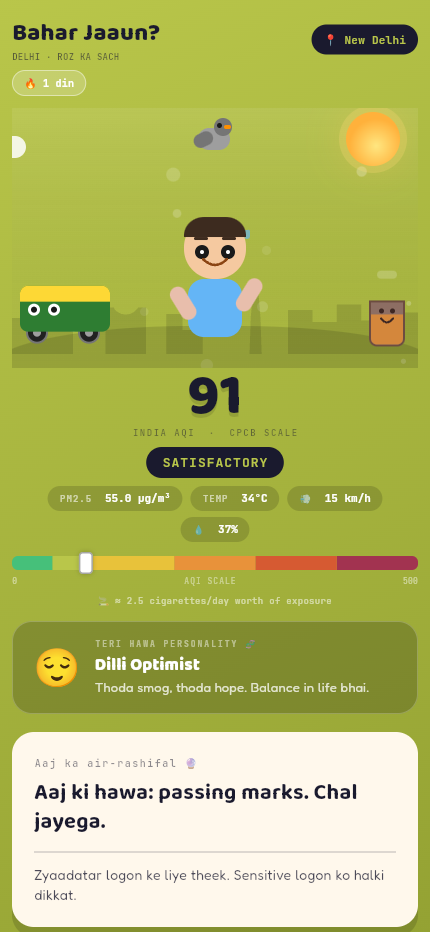
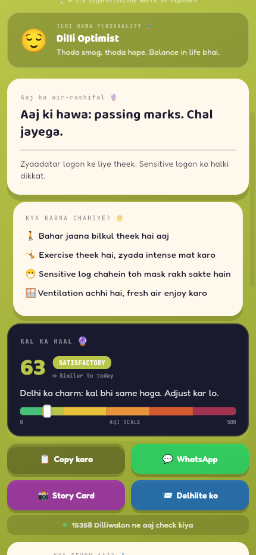
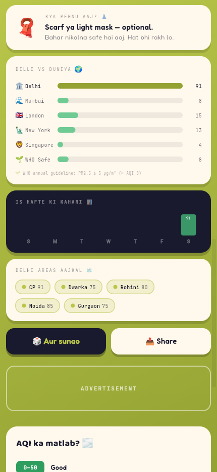
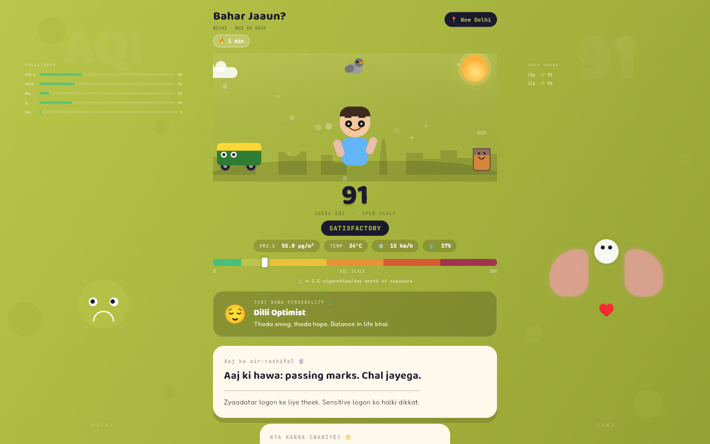

# Bahar Jaaun? 😮‍💨

> **"Should I go outside today?"** — Delhi's daily air quality, told straight in Hinglish.

A Flutter web app that fetches live PM2.5 data, converts it to India's CPCB AQI scale, and gives you an animated scene, personality type, city comparisons, and shareable story cards — so you always know what the hawa is like before stepping out.

**Live →** [cipherabhi.com/baharjaaun](https://cipherabhi.com/baharjaaun/)

---

## Screenshots

| Top of app | Verdicts & Share | Dilli vs Duniya | Desktop |
|:---:|:---:|:---:|:---:|
|  |  |  |  |

---

## Features

### 🌫️ Live AQI — India CPCB Scale

- Fetches real-time **PM2.5** from OpenWeather Air Pollution API
- Converts to **India CPCB AQI (0–500)** — not OpenWeather's coarse 1–5 scale
- Shows **PM2.5 µg/m³, temperature, wind speed, humidity** as stat pills
- Visual **AQI gradient bar** with live position marker
- **Cigarette equivalent** — "≈ 2.3 cigarettes/day worth of exposure"
- **45-minute cache** — no duplicate API calls (SharedPreferences, keyed by lat/lon)

---

### 🎭 Animated Delhi Scene

- **Sky particles** — smog specks in bad air, rain streaks when baarish toggled
- **Spinning sun** — visible when temperature is hot
- **Sliding cloud** — drifts across the scene continuously
- **Delhi skyline silhouette** — India Gate arch + Qutub Minar, gets darker with AQI
- **Animated mascot** — bobs, blinks, sweats, coughs, puts on mask depending on AQI
- **Side cast** — auto-rickshaw, chai glass, pigeon add street life to the scene

---

### 🗣️ Hinglish Verdicts & Cards

- **"Aaj ka air-rashifal 🔮"** — a fresh randomised Hinglish verdict every day
- **🎲 Aur sunao** — tap for another verdict from the same category
- **Activity tips** — what to do / avoid based on current AQI
- **Villain of the day ☠️** — identifies the worst pollutant (PM2.5, NO₂, O₃ etc.)
- **Health fact** — rotating fact shown below every verdict

---

### 🔥 Daily Streak & History

- **Streak counter** — "🔥 n din" — tracks consecutive days checked
- **Streak milestones** — special labels at 3, 7, 14, 30, 50, 100 days
- **"X din bina saaf hawa"** — shows days since last GOOD AQI day
- **7-day sparkline** — colour-coded bar chart of this week's AQI history

---

### 🔮 Tomorrow's Forecast

- Fetches 5-day/3-hour forecast, averages tomorrow's PM2.5 → AQI
- Shows **BETTER / WORSE / SIMILAR** trend vs today
- Lists **safe hours today** — hourly colour-coded bar chart of remaining hours

---

### 🧬 AQI Personality Type

Tells you **"Kaun si personality hai teri?"** based on current AQI + streak:

| Personality | When |
|---|---|
| Pure Soul ✨ | GOOD AQI + streak ≥ 7 days |
| Naseeb Wala 🍀 | GOOD AQI, new streak |
| Dilli Optimist 😌 | SATISFACTORY AQI |
| Casual Breather 😷 | MODERATE AQI |
| Veteran Masker 💪 | MODERATE AQI + streak ≥ 10 days |
| Hardcore Delhiite 🏙️ | POOR AQI |
| Pollution Veteran ☠️ | VERY POOR AQI |
| Iron Lungs 🦾 | SEVERE AQI |

---

### 🌍 Dilli vs Duniya

- Live AQI comparison: **Delhi vs Mumbai, London, New York, Singapore**
- **WHO safe limit** (PM2.5 ≤ 5 µg/m³ ≈ AQI 8) as the baseline bar
- Animated bar chart — fetched in parallel, doesn't block main content

---

### 🗺️ Delhi Neighbourhood Comparison

- Live AQI for **CP, Dwarka, Rohini, Noida, Gurgaon** — fetched in parallel
- Colour-coded chips by AQI category

---

### 👗 Kya Pehnu Aaj?

Outfit recommendation per AQI level: T-shirt → Scarf → Surgical mask → N95 → Hazmat → "Space suit chahiye bhai 🚀"

---

### 📊 Is Mahine Ka Hisaab (Monthly Wrapped)

- Tracks **worst, best, and average AQI** for the current month
- **Cigarette-equivalent exposure** for the month
- Good days 🌿 / Moderate days / Poor+ days ☠️ count badges
- Appears after 2+ days of data

---

### 📸 Story Card

- Opens a **9:16 portrait card** designed for Instagram Stories and WhatsApp Status
- Shows: app branding, date + city, AQI number, category, verdict, URL
- Screenshot → share — no downloads needed
- One-tap **WhatsApp share** from within the dialog

---

### 📤 Viral Share Features

- **📋 Copy karo** — copies formatted Hinglish share text to clipboard
- **💬 WhatsApp** — pre-filled share message
- **📸 Story Card** — Instagram/WhatsApp Status 9:16 card
- **📨 Delhiite ko** — referral message: "Yaar tu Delhi mein rehta hai na? 😷"
- **Social proof counter** — "X Dilliwalon ne aaj check kiya" — grows daily

---

### 🖥️ Desktop Sidebar Characters

On wide screens, two animated characters fill the sidebars:

- **Left — Smog Baba 😤** — cloud face; sleeps (ZZZ) at GOOD, screams (!!!) at SEVERE. Pollutant bars show PM2.5, PM10, NO₂, O₃, SO₂.
- **Right — Lungs Ji 🫁** — breathing lungs; pink + heartbeat at GOOD, shaking + X-eyes at SEVERE. Hourly safe-time dots listed below.

---

### 🎨 Interactive Preview

- **6 colour dots** at bottom — tap any AQI category to preview that air state
- **🌧️ Toggle baarish** — rain on/off, mascot and particles react
- **🎉 Confetti** — rains down when AQI is GOOD (rare event, celebrate it!)

---

## AQI Scale (CPCB India)

| Range | Category | Situation |
|---|---|---|
| 0–50 | Good 🌿 | Step out, breathe deep |
| 51–100 | Satisfactory 😐 | Fine for most people |
| 101–200 | Moderate 😷 | Sensitive groups: be careful |
| 201–300 | Poor 🤧 | Mask up, limit outdoors |
| 301–400 | Very Poor ☠️ | Stay inside |
| 401–500 | Severe 🆘 | Emergency — don't go out |

---

## Tech Stack

| Layer | Choice |
|---|---|
| Framework | Flutter 3.x (web-only) |
| AQI data | OpenWeather Air Pollution API |
| Forecast | OpenWeather Air Pollution Forecast API |
| Weather | OpenWeather Current Weather API |
| AQI standard | India CPCB — 6 categories, 0–500 |
| Fonts | Baloo 2 · Fredoka · JetBrains Mono (google_fonts) |
| Location | geolocator — 8s timeout → Delhi fallback |
| Cache | shared_preferences — 45 min AQI, 3 hr forecast |
| HTTP | http package |
| Links | url_launcher |

---

## Project Structure

```
lib/
├── data/
│   ├── verdicts.dart          # Hinglish verdicts, activity tips, health facts
│   ├── outfit_tips.dart       # Outfit recommendation per AQI category
│   └── personalities.dart     # AQI personality types
├── models/
│   └── aqi_category.dart      # AqiCategory model, pm25ToIndiaAqi(), CPCB breakpoints
├── screens/
│   └── home_screen.dart       # Full app screen — all cards, scene, charts, dialogs
├── services/
│   ├── aqi_service.dart       # OpenWeather fetch, forecast, nearby areas, world cities
│   ├── history_service.dart   # 7-day AQI history + last GOOD day
│   ├── location_service.dart  # Geolocator with 8s timeout + Delhi fallback
│   ├── stats_service.dart     # Monthly stats tracking + daily counter
│   └── streak_service.dart    # Daily streak counter logic
├── theme/
│   └── app_theme.dart         # Colors, Google Fonts helpers
├── widgets/
│   ├── mascot.dart            # Animated character
│   ├── sky_particles.dart     # Smog particles + rain streaks
│   ├── side_cast.dart         # Auto-rickshaw, chai glass, pigeon
│   └── app_footer.dart        # Footer with nav links
└── main.dart
```

---

## Local Setup

```bash
flutter pub get
flutter run -d chrome
flutter build web --release --base-href /baharjaaun/
```

OpenWeather API key is in `lib/services/aqi_service.dart`. Free key at [openweathermap.org](https://openweathermap.org/api).

---

## Disclaimers

- Air quality data: [OpenWeatherMap](https://openweathermap.org/) (updates hourly)
- AQI standard: [CPCB India](https://cpcb.nic.in/)
- Not medical advice.

---

## License

MIT © 2026 [Abhimanyu Kumar](https://cipherabhi.com)
